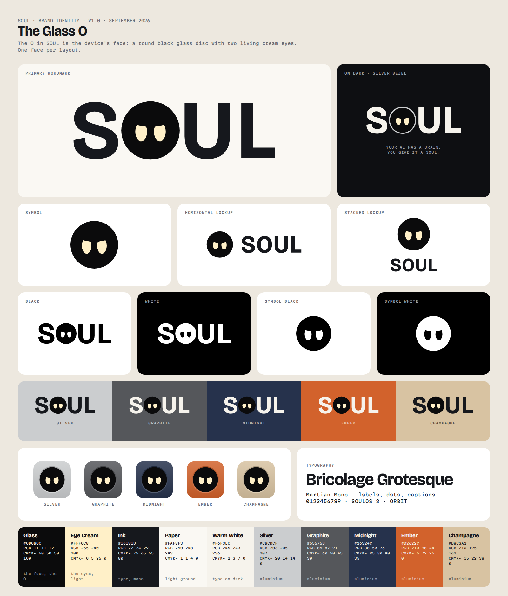

# SOUL: logo and mini brand kit (v1.0, September 2026)

> **Your AI has a brain. You give it a soul.**

The mark is called **The Glass O**. In the all-caps wordmark **SOUL**, the O is the device's face: a round black glass disc with two living cream eyes (#FFF0C8). The eyes have the same slightly knowing lid as the v6 renders. Nothing is typed. Every letter is an outlined vector path, the disc and the eyes are hand-built geometry, and no SVG depends on a font.



---

## 1. How the direction was chosen

We explored six directions. All the SVGs are in `directions/`, and the contact sheet is `logo-directions.png`.

| | Direction | Idea | Verdict |
|---|---|---|---|
| **A** | **Glass O** | The O is the face: a black disc with two lidded eyes | **Chosen** |
| B | Pebble | The product silhouette as a pictogram, with a spaced wordmark | Reads as "a gadget icon". The pebble outline is weak at 16 px and close to generic rounded-square app glyphs |
| C | Lidded Counter | A heavy O whose counter is a single lidded eye | Clever, but one eye loses SOUL's defining pair, and it reads as a wink or a "D" at small sizes |
| D | Orbit | A glass ring, the eyes and the SoulOS orbit arc on the lower rim, with a mono wordmark | The arc turns it into a smiley, the most clichéd face there is |
| E | Blink | The two eyes alone, with the O as one solid eye | Striking, but without the glass disc it reads as a mask or an alien, and the "S●UL" wordmark falls apart |
| F | Grid Monogram | S O / U L on a 2×2 tile | Fine as an app tile, but generic ("four letters in a square"), and it doubles the face |

**Why A wins:**
1. **It is the product.** The black glass disc with two cream eyes is exactly what you see when you meet a SOUL. The logo, the device, the boot screen and the app icon become one image.
2. **It reads everywhere.** SOUL stays four plain Latin capitals, so it works in any language. The face sits inside a letter people already read as O.
3. **It scales.** The symbol (disc + eyes) works from a 16 px favicon up to a laser-etched base. There is a pixel-fitted 16 px master.
4. **It has a personality without clichés.** It has no brain, no circuit nodes, no sparkles and no robot head. The only character is the lid of the eyes.
5. **It has room to be ownable.** It avoids the big tech marks: no apple, no dot-matrix type (Nothing), no asterisk or burst (Anthropic/Claude), no hexagonal knot (OpenAI), no orange square or rabbit (Rabbit), no plain white disc (Friend). It also differs from the Soul Electronics and Soul app marks, which are script or wordmark logos with no face. **This is a visual check only, not a legal clearance.** Run a trademark search (EUIPO/WIPO, classes 9, 28 and 42) before filing.

---

## 2. The system

**One face per layout.** When the symbol is on the page, the wordmark next to it uses a plain O (the horizontal and stacked lockups). When the wordmark stands alone, its O is the face. Never show two faces side by side.

| Asset | File (SVG → PNG in `png/`) | Use |
|---|---|---|
| Primary wordmark | `svg/soul-wordmark.svg` | Default. Ink letters, a glass O and cream eyes, on light grounds |
| Wordmark, dark | `svg/soul-wordmark-dark.svg` | Dark grounds. Warm-white letters, and the glass O gets a **silver bezel** ring like the chrome ring round the real glass |
| Wordmark, mono | `svg/soul-wordmark-black.svg`, `…-white.svg` | One colour. The eyes are **knocked out** (transparent). Use for etching, embossing, fax/print and single-colour print |
| Symbol | `svg/soul-symbol.svg`, `…-dark.svg`, `…-black.svg`, `…-white.svg` | Avatars, social, device UI, stamp |
| Horizontal lockup | `svg/soul-lockup-horizontal*.svg` | Nav bars, email signatures, partner walls |
| Stacked lockup | `svg/soul-lockup-stacked*.svg`, `…-stacked-tagline*.svg` | Packaging, posters, splash screens |
| App icon | `svg/soul-app-icon.svg` (= Silver), `soul-app-icon-{silver,graphite,midnight,ember,champagne}.svg`, `soul-app-icon-fullbleed.svg` | The companion app. Ship Silver by default and offer the other finishes as alternate icons. The full-bleed file is for stores and OSes that apply their own mask |
| On product colours | `svg/on-colour/soul-wordmark-on-{colour}.svg` | Reference artwork for each finish |
| Favicon | `favicon/favicon.svg` (adds a silver bezel in dark mode), `favicon-16.svg` (pixel-fitted master), `favicon-16/32/48.png`, `favicon.ico`, `apple-touch-icon.png` (180), `icon-192.png`, `icon-512.png` | Web |

```html
<link rel="icon" href="/favicon.svg" type="image/svg+xml">
<link rel="icon" href="/favicon.ico" sizes="48x48">
<link rel="apple-touch-icon" href="/apple-touch-icon.png">
<!-- manifest: icon-192.png, icon-512.png (purpose "any maskable") -->
```

### Construction (`construction-clearspace.png`)
- **Letters** S, U and L are Bricolage Grotesque with wght 700, opsz 96, wdth 100 and tracking +55/1000. They are outlined and their overlaps removed.
- **The O disc** is 1.02 × the height of Bricolage's O, which is **1.06 × cap height (H)**. It shares the O's centre and is optically kerned ≈2 % H tighter on both sides.
- **The eyes** (for a disc of radius R):
  - Each eye is an ellipse 0.40 R wide × 0.68 R tall.
  - The eye centres sit 0.64 R apart and 0.04 R below the centre of the disc.
  - Each eye has one straight lid, 0.24 R above the eye centre at the outer edge and 0.16 R at the inner edge, which gives an 11° brow. The inner corners sit lower, which gives the look of the renders.
- **The dark bezel** puts the disc at 0.915 R inside a ring of #CBCDCF.

### Clear space
**X = ½ Ø**, which is half the diameter of the glass O, or roughly half the cap height. Keep X clear on every side of the wordmark and the lockups. For the symbol on its own, keep ¼ Ø.

### Minimum size

| Asset | Screen | Print | Laser etch / deboss |
|---|---|---|---|
| Wordmark | 72 px wide | 18 mm | 10 mm |
| Horizontal lockup | 96 px wide | 22 mm | 14 mm |
| Symbol | 16 px (below 24 px use `favicon-16`) | 5 mm | 4 mm |

---

## 3. Colour

| Name | HEX | RGB | CMYK (approx., proof before print) | Role |
|---|---|---|---|---|
| Glass | `#0B0B0C` | 11 11 12 | 60 50 50 100 (rich black) | The face and the O |
| Eye Cream | `#FFF0C8` | 255 240 200 | 0 5 25 0 | The eyes and light (this is also the site's `--cream`) |
| Ink | `#16181D` | 22 24 29 | 75 65 55 80 | Letters on light grounds |
| Paper | `#FAF8F3` | 250 248 243 | 1 1 4 0 | Light ground |
| Warm White | `#F6F3EC` | 246 243 236 | 2 3 7 0 | Letters on dark grounds |
| Silver | `#CBCDCF` | 203 205 207 | 20 14 14 0 | Finish, and the bezel ring |
| Graphite | `#55575B` | 85 87 91 | 60 50 45 30 | Finish |
| Midnight | `#26324C` | 38 50 76 | 95 80 40 35 | Finish |
| Ember | `#D2622C` | 210 98 44 | 5 72 95 0 | Finish, and the accent |
| Champagne | `#D8C3A2` | 216 195 162 | 15 22 38 0 | Finish |

The five finish values are the aluminium sRGB references from `docs/02-MANUFACTURING.md`.

**Letter colour on each product colour:** use Ink on Silver and Champagne, and Warm White on Graphite, Midnight and Ember. **The O always stays black glass with cream eyes** in full colour, the way the real glass does on every finish. On near-black grounds use `-dark` (bezel) or `-white`.

---

## 4. Typography
- **Bricolage Grotesque** (display and headlines) is the family the wordmark is cut from. Use 700 for headlines and 500 for large text.
- **Martian Mono** (labels, data, captions, the tagline in caps with +40/1000 tracking) is the same pairing as SoulOS "Orbit" (os/SPEC.md §11).
- The landing page currently loads Fredoka, Instrument Sans and JetBrains Mono. Moving `--f-display` to Bricolage Grotesque and `--f-mono` to Martian Mono would align the site with the logo and the OS. That change is not made here.

---

## 5. Rules
**Do**
- Use the supplied files. Never retype "SOUL" in a font.
- Keep the eyes cream (#FFF0C8) in full colour. In one-colour work, knock the eyes out so the material shows through, like un-etched metal or bare board.
- On aluminium, laser-etch or deboss the **mono** wordmark, so the disc is etched and the eyes stay as bare metal. See `mockups/mockup-etched-base.png`.

**Don't**
- Don't draw a mouth, a smile arc, eyebrows, a blush or sparkles on the logo. The device can emote, but the logo stays calm.
- Don't show two faces in one layout: no symbol next to the Glass-O wordmark.
- Don't change the lid angle or turn the eyes into circles or hearts. (Animated eyes belong in the product and in motion, not in the static mark.)
- Don't stretch, outline, shadow, add gradients to or rotate the wordmark. The only gradients allowed are in the app icon tiles.
- Don't put the full-colour O on a ground darker than Graphite without the bezel.
- Don't set the wordmark in lowercase or with a different O.

---

## 6. Mockups (`mockups/`)
- `mockup-etched-base.png` and `mockup-etched-base-detail.png`: the mono wordmark laser-etched on the base plate, composited onto `renders/v6/soul_v6_bottom.png`. It replaces the second engraved line.
- `mockup-box-lid.png`: a Founders 00 box in soft-touch graphite board with the warm-white foil wordmark and the Martian Mono tagline.
- `mockup-landing-nav.png`: the real `site/index.html`, rendered offline with the new dark wordmark swapped into `.nav .brand` (21 px tall). A 2× zoom of the nav is below it.
- `mockup-app-icon-phone.png`: the icon on a generic phone home screen, with the five finish variants.

---

## 7. Licences
- **Bricolage Grotesque** © 2022 The Bricolage Grotesque Project Authors and **Martian Mono** © 2021 The Martian Mono Project Authors are both under the **SIL Open Font License 1.1**. The full texts are in `licenses/`.
- The OFL allows fonts to be used in logos. Here the glyphs were instanced from the variable fonts, outlined to paths and then altered: the O was replaced and the spacing changed. **No font software is embedded or distributed** in any SVG or PNG, so the artwork carries no font dependency and no licence obligation beyond this attribution.
- The disc, eyes, bezel, app-icon geometry and favicon-16 master are original constructions made for SOUL. No raster tracing or stock art was used.

## 8. Rebuilding
All artwork is generated by the scripts in `source/`. Run `pip install fonttools skia-pathops playwright pillow numpy`, then `python -m playwright install chromium`. From `source/`, run `python fetch_fonts.py`, then `build.py`, `sheets.py`, `directions.py` and the `mock_*.py` scripts. The output paths are absolute to this vault, so edit `ROOT` in the scripts if the vault moves. The geometry lives in `kit.py` (brand constants and the face, wordmark, lockups and icons) and in `soul.py` (the outlining and path primitives).

---

## Rezumat (RO)

**Logo-ul ales: „The Glass O” (O-ul de sticlă).** În wordmark-ul SOUL, scris doar cu majuscule, litera O este chiar fața dispozitivului: un disc negru de sticlă cu doi ochi vii, crem (#FFF0C8), cu pleoapa ușor „șmecheră” din randări. Literele S, U și L sunt din Bricolage Grotesque 700, transformate în contururi, iar discul și ochii sunt construiți geometric. SVG-urile nu depind de niciun font.

**De ce:** logo-ul este chiar produsul. Se citește în orice limbă, merge de la favicon de 16 px până la gravura laser de pe bază și evită clișeele (creier, circuite, scântei, cap de robot) și asemănarea cu Apple, Nothing, Anthropic/Claude, OpenAI, Humane, Rabbit, Friend, Soul Electronics și aplicația Soul. Înainte de înregistrare trebuie făcută o verificare de marcă (EUIPO/WIPO).

**Reguli pe scurt:**
- Pe o pagină apare o singură față: lângă simbol, wordmark-ul are un O simplu.
- Spațiul liber este jumătate din diametrul O-ului, pe toate laturile.
- Mărimi minime: wordmark 72 px / 18 mm, simbol 16 px / 5 mm.
- În versiunea color, O-ul rămâne mereu sticlă neagră cu ochi crem. Pe fundal foarte închis se folosește varianta cu ramă argintie (`-dark`).
- Literele sunt Ink pe Silver și Champagne și Warm White pe Graphite, Midnight și Ember.
- Pe aluminiu se gravează versiunea mono: discul se gravează, iar ochii rămân metal.
- Nu adăugați gură, zâmbet, sprâncene sau scântei. Nu deformați logo-ul și nu îl rescrieți cu un font.

**Fișiere:**
- `svg/`, `png/` și `favicon/`: logo-urile și faviconurile
- `mockups/`: gravura pe bază, cutia, navigația site-ului și iconița pe telefon
- `logo-directions.png`: cele 6 direcții explorate
- `brand-kit-overview.png` și `construction-clearspace.png`: prezentarea kit-ului și construcția
- `licenses/`: licențele OFL ale fonturilor
- `source/`: scripturile care generează tot
