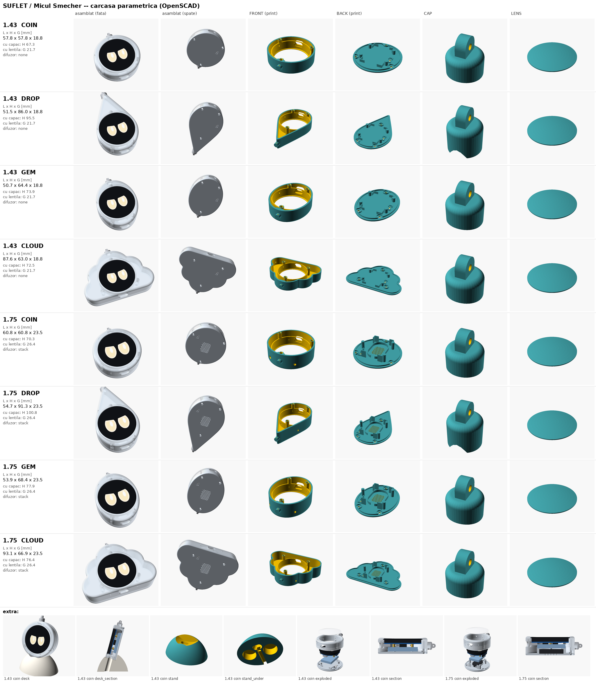

# Carcasa SUFLET / Micul Șmecher: CAD parametric (OpenSCAD)

**Stare: v1 completă, încă neprintată** (2026-09-24). Toate piesele se generează dintr-un singur fișier, `micul_smecher.scad`. Fiecare STL e exportat cu CGAL și verificat automat (muchii manifold, orientare, volum) și are o randare PNG. Primul print ar trebui să fie un test de potrivire în PETG. Cotele marcate `// UNVERIFIED` trebuie măsurate cu șublerul înainte de printul final în rășină.



## Fișiere

| fișier | ce conține |
|---|---|
| `micul_smecher.scad` | modelul parametric cu toate piesele și vederile |
| `shapes.scad` | cele 4 siluete (MONEDĂ, LACRIMĂ, CABOCHON, NOR). **Generat**, nu se editează de mână |
| `gen_shapes.py` | portează matematica formelor din pagina de concept și scrie `shapes.scad` |
| `build_all.py` | exportă toate STL-urile, le verifică, randează PNG-urile și `renders/lineup.png` |
| `check_stl.py` | verificare STL: triunghiuri, muchii manifold, orientare, carcase, volum |
| `stl/` | 33 de fișiere `ms<placă>_<formă>_<piesă>.stl`, plus `CHECKS.txt` (rezultatul verificării) și `dims.json` (cotele fiecărei variante) |
| `renders/` | PNG pentru fiecare piesă, asamblat (față/spate), explodat, secțiune, stand. `lineup.png` e foaia de contact cu toate |

Toate STL-urile sunt deja în **poziția de print**: FRONT cu fața în jos, BACK cu fața exterioară în jos, standul pe talpă.

## Cum schimbi forma, placa sau piesa

În OpenSCAD: *Window → Customizer*. Alegi `board`, `shape` și `part`, apoi F6 și *Export STL*.

Din linia de comandă:

```bash
openscad -o front.stl -D 'board="1.43"' -D 'shape="drop"' -D 'part="front"' micul_smecher.scad
openscad -o back.stl  -D 'board="1.75"' -D 'shape="gem"'  -D 'part="back"' -D 'printer="FDM"' micul_smecher.scad
python3 build_all.py            # tot setul: STL + verificare + PNG + lineup (~15 min pe 4 nuclee)
python3 build_all.py --stl      # doar STL + verificare
python3 check_stl.py stl/*.stl  # doar verificarea
```

| parametru | valori | ce face |
|---|---|---|
| `board` | `"1.43"` / `"1.75"` | 1.43 = Founders (desk, USB). 1.75 = Voice (2 microfoane + difuzor) |
| `shape` | `coin` `drop` `gem` `cloud` | silueta. Scara se calculează automat ca să încapă placa, peretele și bosajele |
| `part` | `front` `back` `cap` `lens` `stand` | piese de printat |
| | `assembly` `exploded` `desk` `board` | vederi (placă, baterie și difuzor sunt doar machete) |
| `section` | `true` / `false` | taie vederile în jumătate la x = 0, ca să vezi coliziunile |
| `printer` | `"SLA"` / `"FDM"` | toleranța de potrivire: 0.2 mm (SLA) sau 0.3 mm (FDM). `tol_override` o forțează |
| `battery` | `true` / `false` | `false` = versiune doar pe USB (Founders desk): fără suporți de baterie, carcasă mai subțire |
| `bat_w/bat_l/bat_t` | 25 / 35 / 5.0 | celula LiPo (implicit 502535) |
| `bat_foam` | 0.8 | spațiu pentru spumă și umflare (fără lipici!) |
| `spk_mode` | `"stack"` / `"none"` | 1.75: difuzorul kitului în spatele bateriei, sau fără difuzor (mai subțire) |
| `wall` | 1.8 | peretele lateral (1.6 – 2.0) |
| `lip_overlap` | 0.8 | cât acoperă buza sticla (radial) |
| `shape_grow` / `squash_top` | 1.0 | mărește silueta / scurtează partea de deasupra ecranului |
| `stand_tilt` | 15 | înclinarea ecranului pe stand, în grade față de verticală |

## Dimensiuni (L × Î × G, mm, fără capac și fără lentilă)

| formă | 1.43 (Founders) | 1.75 (Voice, cu difuzor) |
|---|---|---|
| MONEDĂ `coin` | **57.8 × 57.8 × 18.8** | 60.8 × 60.8 × 23.5 |
| LACRIMĂ `drop` | 51.5 × 86.0 × 18.8 | 54.7 × 91.3 × 23.5 |
| CABOCHON `gem` | 50.7 × 64.4 × 18.8 | 53.9 × 68.4 × 23.5 |
| NOR `cloud` | 87.6 × 63.0 × 18.8 | 93.1 × 66.9 × 23.5 |

* Capul cu inel adaugă **+9.5 mm** în înălțime. Lentila dom adaugă **+2.9 mm** în grosime.
* 1.75 fără difuzor (`spk_mode="none"`) are 17.7 mm grosime. Cu `battery=false`, 1.43 ajunge la 17.0 mm.
* Standul de birou (1.43 monedă) are talpa 68 × 53 mm și înălțimea totală de aproximativ 81 mm cu amuleta în el. Dacă ai printat altă formă, standul se regenerează automat pentru ea.

## Piesele

* **FRONT**: cochilia din rășină clară, mată. Are:
  * o buză de 0.8 mm peste marginea sticlei, un locaș de 0.4 mm pentru lentilă și un buzunar care urmează conturul sticlei;
  * 3 bosaje cu găuri Ø3.2 × 4 pentru inserții M2×3, plasate automat pe siluetă, niciodată în zona USB-C;
  * decupajul USB-C la ora 6, pe axa plăcii;
  * găuri de ac pentru BOOT/RESET (1.43, ora 9) sau pentru PWR și BOOT (1.75, sus), plus 2 găuri de microfon (1.75);
  * știftul Ø6 pentru capac, în vârful formei. Ramele de pe lângă placă sunt golite ca să folosească mai puțină rășină.
* **BACK**: capacul din spate, prins cu 3 șuruburi M2×4 cu cap cruce, fără lipici. Are:
  * o fustă de centrare și stâlpi care apasă distanțierele plăcii prin câte un punct de spumă EVA;
  * 4 colțari în L pentru baterie, ca firele să poată ieși pe orice parte;
  * leagănul pentru comutatorul MSK-12C02, cu fantă și locaș în exterior;
  * la 1.75: inelul pentru difuzor și grila.
* **CAP**: căciulița de la vârf. Se pune pe știft și se fixează cu un șurub M2 (sau o picătură de CA). Urechea are gaură Ø1.6 pentru un inel spintecat de 12 mm. Șaua ei urmează exact conturul formei.
* **LENS**: cabochon clar opțional peste sticlă. Are 0.3 mm aer deasupra sticlei, flanșă de 1.6 mm în locașul de 0.4 mm și dom de 2.5 mm.
* **STAND** (Founders Desk Edition, alimentat prin USB): o „piatră de râu”, adică un elipsoid tăiat, cu o fantă în care amuleta stă sprijinită pe muchia de jos și înclinată 15° pe spate. Mufa USB-C coboară drept într-un buzunar, iar cablul iese pe dedesubt, printr-un canal, spre spate. Partea din față e tăiată la 4 mm, ca să nu acopere ecranul. Are 2 buzunare de lest pe dedesubt.

## Setări de print

**SLA, piesele finale (FRONT, BACK, CAP, LENS):**

* Rășină clară (clear / water-clear), strat de **0.05 mm**, `printer="SLA"`.
* Orientare la 30–45°. Suporții merg doar pe interior sau pe fața de îmbinare, **niciodată pe fața din față sau pe flancuri**.
* Spălare în IPA 2 × 3 min, apoi uscare completă. Abia apoi **post-curare** UV 405 nm, după fișa rășinii (de obicei 5–10 min la 60 °C). Nu supra-cura rășina clară, fiindcă se îngălbenește.
* **Mat („frosted”)**: șlefuire umedă cu 400 → 600 → 800 → 1000 → 1500, apoi 2–3 straturi subțiri de **lac transparent mat**.
* **LENS rămâne clară**: șlefuire umedă până la 2000–3000, apoi pastă de polish sau lac lucios. Fără mat pe lentilă.

**FDM PETG, doar pentru teste de potrivire și pentru stand:**

* `printer="FDM"` (toleranță 0.3), strat de 0.2 mm (0.12 pentru CAP), 3 perimetre, umplere 20–30 %.
* Orientare ca în STL: fără suporți pentru FRONT, BACK și STAND. Tavanele buzunarelor de lest sunt poduri scurte.
* Inserțiile M2 se pun la cald (letcon la ~230 °C), la nivel cu fața de îmbinare.
* În rășină SLA, inserțiile la cald nu țin bine, pentru că rășina e termorigidă. Le presezi și pui o picătură de epoxi. Gaura e `insert_d` = 3.2 și o ajustezi la inserția ta.

## Listă de hardware (pentru o bucată)

| buc | ce | note |
|---|---|---|
| 1 | Waveshare ESP32-S3-Touch-AMOLED-**1.43** (Founders) sau **-1.75** (Voice) | 1.75 are difuzorul 8 Ω 2 W în kit |
| 1 | LiPo **502535** 3.7 V (~400 mAh) cu PCM și conector 2 pini 1.25 mm | măsoară celula reală (vezi mai jos). Nu la Founders pe USB |
| 1 | comutator glisant **MSK-12C02** + 2 conectori 1.25 mm (tată/mamă) | pus pe un cablu-adaptor, ca bateria să rămână „plug-in” |
| 3 | inserție M2×3, filetată (heat-set sau press-in), Ø3.2–3.6 | în bosajele din FRONT |
| 3 | șurub **M2×4** cu cap cilindric bombat, cruce (ISO 7045 / DIN 7985), inox A2 | DIN 965 (cap înecat) dacă vrei capul la nivel |
| 1 | M2×3 știft filetat (opțional) | fixează capacul pe știft |
| – | spumă EVA 0.5–1 mm | sub baterie și pe cei 3–4 stâlpi |
| 1 | inel spintecat 12 mm + lanț sau carabină | agățătoarea |
| stand | alice de oțel sau BB 4.5 mm + epoxi, pâslă sau plută de 1 mm, cablu USB-C cu mufa ≤ 12.4 × 7.0 mm | lestul și talpa pot fi lipite (nu țin de baterie) |

## Asamblare

1. Post-procesezi piesele (spălare, curare, șlefuire, lac). Montezi cele 3 inserții în FRONT, la nivel cu fața de îmbinare.
2. Pui placa din spate în FRONT, cu sticla în buză și cu USB-C la ora 6, în dreptul decupajului.
   * **La 1.43, placa e rotită cu 90° față de desenul Waveshare** (acolo USB-ul e la ora 9). BOOT/RESET ajung la ora 9.
   * În firmware setezi o singură dată `SUFLET_ROTATION` în `firmware/src/board.h`, ca ochii să stea drept.
3. Comutatorul intră în leagănul din BACK, cu butonul în fantă. Îl legi pe firul + al bateriei, printr-un adaptor cu conectori 1.25 mm, ca bateria să se poată schimba fără lipit.
4. Bateria stă pe spumă, între cei 4 colțari, **fără lipici**. Conectorul ei merge la placă prin adaptorul cu comutator.
5. Doar la 1.75: pui difuzorul în inelul lui, cu membrana spre grilă, și conectorul la SPK.
6. Pui câte un punct de spumă EVA de 0.5 mm pe capătul fiecărui stâlp. Închizi BACK cu 3 × M2×4, fără să strângi tare.
7. Pui CAP-ul pe știft (cu știftul M2 sau o picătură de CA) și inelul de 12 mm.
8. LENS, opțional: o așezi în locașul de 0.4 mm și o fixezi cu 3–4 puncte de rășină UV sau cu bandă optică transparentă pe flanșă.
9. STAND:
   * torni alice de oțel cu epoxi în cele 2 buzunare și lipești pâsla pe talpă, **fără să acoperi canalul**;
   * treci mufa USB-C de jos, prin buzunar, și o bagi în amuletă;
   * așezi amuleta în fantă și pui cablul în canal.

Schimbarea bateriei (Regulamentul UE 2023/1542, de la 18 feb. 2027) se face cu o șurubelniță PH0: 3 șuruburi, conector, gata. Fără lipici, fără căldură, fără lipire.

## Cote verificate (din fișierele STEP/DXF Waveshare)

| cotă | 1.43 | 1.75 |
|---|---|---|
| sticlă (Ø × grosime) | Ø46.00 × 1.10, față plană Ø43.0 | Ø48.96 × 1.10, față plană Ø44.16 |
| PCB (Ø, adâncime față/spate de la fața sticlei) | Ø43.5, 5.00 / 6.20 | Ø46.0, 5.70 / 6.90 |
| distanțiere M2 (capăt) | 4 buc. la ±15.75 / ±11.55, adâncime 10.22 | 3 buc. (14.70, ±13.75), (−20.50, 0), adâncime 10.43 |
| USB-C (fața mufei / centrul limbii) | r 22.46 / adâncime 7.87 | r 23.80 / adâncime 8.55 |
| cea mai adâncă piesă (conectori) | 10.70 (2 × 7 pini) | 12.70 (8 pini) |
| butoane | 2 taste radiale Ø2 la (±8.01, 18.43) nativ, adâncime 7.85, vârf la r 20.97 | PWR și BOOT sus, adâncime 7.60 |

Axele modelului: USB-C jos. La 1.43 cotele native Waveshare sunt rotite cu +90°.

## De măsurat cu șublerul (UNVERIFIED în `.scad`)

1. **Mufa cablului USB-C**: `usb_cut_w` × `usb_cut_h` (12.4 × 7.0). La stand, și `stand_plug_len` (16, cât iese mufa din carcasă) și `stand_cable_d` (4.5).
2. **Bateria reală**: `bat_w`, `bat_l`, `bat_t`. Celulele „502535” variază: 4.8–5.3 × 25–26 × 35–38 mm, cu PCM cu tot.
3. **MSK-12C02**: `sw_body`, `sw_act`, `sw_travel` pentru lotul tău.
4. **Difuzorul din kitul 1.75**: `spk_w/l/t` (desenul Waveshare zice 20 × 30 × 5.5), `spk_r` și zona grilei `spk_grille_w/l`.
5. **1.43**: care din cele 2 taste e BOOT și care e RESET (după serigrafie). Găurile sunt identice, deci modelul nu se schimbă.
6. **1.75**: direcția portului la microfoane. Modelul presupune port pe față, deci trebuie verificată poziția găurilor.
7. **Inserțiile tale**: diametrul exterior, ca să setezi `insert_d`.
8. **1.43**: fața plană a sticlei, `glass_flat_r` = 21.5. Vine din notele DXF, nu din STEP.
9. **La prima potrivire**:
   * buza de 0.8 mm trebuie să țină sticla fără joc;
   * stâlpii capacului (`post_gap` 0.3 + spumă) trebuie să apese placa, dar nu prea tare;
   * USB-C trebuie să intre complet.

## Probleme cunoscute și limite

* **1.75 cu difuzor e gros: 23.5 mm**, peste ținta de 20 mm. Difuzorul 20 × 30 × 5.5 stă în spatele bateriei, pentru că pe lângă placă nu e loc: conectorii sunt pe margini, la 12.7 mm adâncime.
  * Cu `spk_mode="none"` ajungi la 17.7 mm.
  * Mai sunt două variante: o baterie mai subțire (`bat_t`) sau un difuzor mai mic.
* **Moneda are Ø57.8 (1.43) / Ø60.8 (1.75)**. Diametrul e dat de cele 3 bosaje cu inserții din afara sticlei. Placa singură ar permite ~Ø51.
* Lentila adaugă 2.9 mm, deci 1.43 cu lentilă are 21.7 mm.
* Pe stand, jocul de 0.6 mm poate înclina amuleta cu ~2–4° peste `stand_tilt`.
  * Buzunarele de lest sunt tăiate lângă buzunarul mufei, așa că se umplu cu alice și epoxi, nu cu șaibe.
  * Standul e calculat pentru 1.43. La 1.75, peretele fantei poate acoperi parțial găurile de microfon.
* Machetele din vederi (placă, baterie, difuzor) sunt simplificate. Coliziunile au fost verificate doar în secțiunile din `renders/`.
