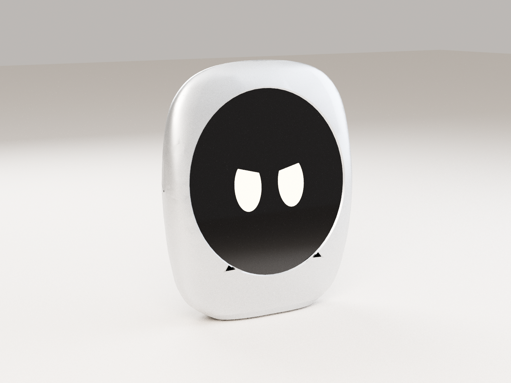
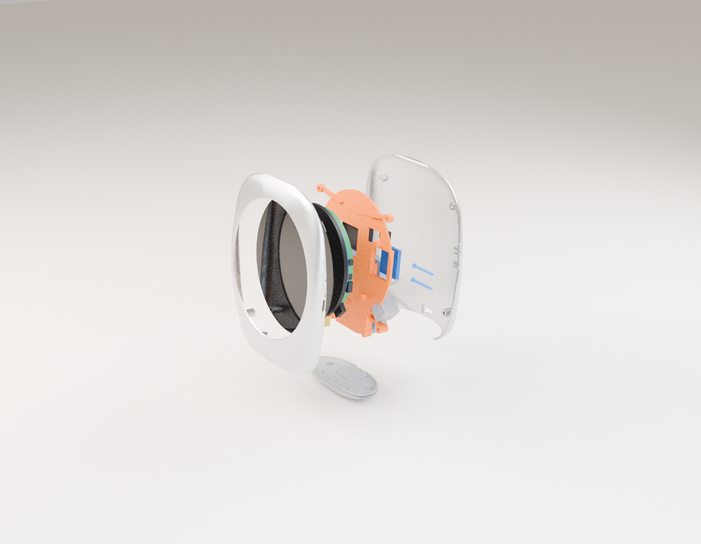

# SOUL-P0 mărimea M: kitul de prototip făcut acasă

**Pentru Andu. Ghid pas cu pas, fără să fii inginer.** Versiunea: 2026-09-25 (P0-M, rev A).

SOUL-P0 M este prototipul „se poate face acasă” al lui SOUL mărimea **M**. Folosește placa Waveshare **ESP32-S3-Touch-LCD-2.8C**, cu ecran rotund IPS de 2,8″ (480 × 480). Carcasa are aspectul **v6**: aceeași siluetă din față ca `renders/v5/soul_v5_front_00.png`, sticlă neagră mare, nimic altceva pe față, bază plată cu piciorul oval din polimer și fanta difuzorului în cusătura laterală.

> **Varianta mică (S)**, cu placa AMOLED 1,75″, e oprită la decizia fondatorului. Tot ce era făcut pentru ea (CAD, STL, STEP) e păstrat în [`legacy-S/`](legacy-S/).



*Randare din fișierele CAD de mai jos, cu materialele v6. Nu e fotografie și nu e randarea de concept.*

---

## 0. Ce trebuie să știi înainte

### Mărimea reală: ~112 × 128 × 34 mm, nu 90 × 103

Estimarea „≈ 90 × 103” pornea de la **panoul gol** de 2,8″, care are ~73 mm. Placa 2.8C de cumpărat are însă sticla lipită din fabrică, cu **diametrul de 95,86 mm** (desenul Waveshare `ESP32-S3-Touch-LCD-2.8C-20241226`). Sticla nu se poate scoate acasă.

Ca sticla să stea în masa plată a feței, cum stă sticla Ø52 la v6, silueta v6 se mărește uniform cu **k = 1,78**. Rezultă:

| | S (v6, 1,75″) | **M-P0 (2.8C)** |
|---|---|---|
| Lățime × înălțime | 63 × 72,2 | **112,1 × 127,6** (cu piciorul de 1,2) |
| Adâncime | 27 | **33,6** (crește cu 24 %, nu cu 78 %: stiva de 9,7 mm + bateria de 6 mm + difuzorul) |
| Sticla vizibilă / lățime | 52 / 63 = 0,825 | 92,9 / 112,1 = **0,83** (la fel ca v6) |
| Ecran activ | Ø43,8 | **Ø70,64** (tastele de ~6,6 mm) |

Un corp de **90 × 103 mm** se poate face doar cu panoul gol și o placă proprie. Asta e treabă pentru EVT, nu pentru acasă (vezi `research/12-ecran-mai-mare.md`).

### Ce e verificat și ce nu

- **Cote verificate** din desenul Waveshare:
  - sticla Ø95,86 × 0,7;
  - zona vizibilă Ø70,64;
  - LCD + sticlă 3,66 mm; spatele plăcii la 5,7 mm; cea mai înaltă piesă la 9,7 mm;
  - placa Ø73;
  - 4 găuri M2 la (±29,5; 15,14) și (±18; −25,56).
- **Cote NEverificate**, marcate `UNVERIFIED` în cod (±1 mm): pozițiile tastelor BOOT/RST, a comutatorului ON/OFF, a celor două USB-C și a mufei BAT. Le-am citit de pe poza și desenul Waveshare. **Măsoară-le cu șublerul când vine placa** (pasul E1).
- Verificarea de coliziune se face în CAD, pe modelul real. Rezultatele sunt la §G.

---

## A. Lista de cumpărături

Prețurile sunt orientative, din septembrie 2026. Am folosit 1 € ≈ 5,1 lei și 1 $ ≈ 4,4 lei. Transportul din China e de obicei gratuit sau 5–15 lei la AliExpress Choice.

### A1. Electronica (pe bucată)

| # | Ce | Exact ce cauți | De unde (linkuri) | Preț / buc. |
|---|---|---|---|---|
| 1 | **Placa** | **Waveshare ESP32-S3-Touch-LCD-2.8C** (varianta **cu touch**, „Touch”). **Nu** ESP32-S3-Touch-LCD-2.8, care e dreptunghiulară, 240×320 | [waveshare.com (oficial)](https://www.waveshare.com/esp32-s3-touch-lcd-2.8c.htm) ~$30–40 + transport · [AliExpress](https://www.aliexpress.com/item/1005009311521684.html) ~$41–43 · [Amazon](https://www.amazon.com/Waveshare-Capacitive-Development-Dual-core-Processor/dp/B0DMJZPH2R) ~$43 | **≈ 180–200 lei** |
| 2 | **Baterie LiPo** | **604050**, 3,7 V, **~1500 mAh**, cu PCM (protecție), mufă **MX1.25 2 pini** (sau PH2.0 + adaptor). Plicul: **6 × 40 × 50 mm**, iar CAD-ul lasă loc pentru 6,3 × 40,5 × 50,5 (o celulă 605060 de 2000 mAh nu mai lasă loc difuzorului) | AliExpress: „604050 1500mAh 3.7V MX1.25” sau „604050 lipo” | **≈ 30–45 lei** |
| 3 | **Difuzor** | „2030 cavity speaker”, **8 Ω, 1 W**, cutie de 20 × 30 × ~5 mm, cu fire | AliExpress: „2030 speaker 8ohm 1W” · eMAG: „difuzor 8 ohm 1W 2030” | **≈ 8–15 lei** |
| 4 | **Amplificator I2S** | **MAX98357A** (modul de 3 W, clasa D) | [Optimus Digital (Adafruit)](https://www.optimusdigital.ro/ro/audio-amplificatoare-audio/1656-modul-cu-amplificator-adafruit-i2s-de-3-w-in-clasa-d-max98357a.html) · [ArduShop](https://ardushop.ro/en/modules/1549-max98357-i2s-3w-class-d-amplifier-6427854022967.html) | **≈ 20–45 lei** |
| 5 | **Microfon I2S** | **INMP441** (modul de 12 × 14 × 3 mm) | [eMAG](https://www.emag.ro/modul-microfon-inmp441-omnidirectional-i2s-24-biti-mems-12-x-14-x-3-mm-negru-s9/pd/D83G1QYBM/) · [ArduShop](https://ardushop.ro/ro/home/2092-omnidirectional-microphone-module-i2s-interface-inmp441-mems-high-precision-low-power-ultra-small-volume-for-esp32.html) | **≈ 15–25 lei** |
| 6 | **Prelungitor USB-C** | USB-C **tată în unghi de 90°** → USB-C **mamă de montaj pe panou**, 10–20 cm. Mama merge în spate, jos: pe acolo se încarcă | AliExpress: „USB C 90 degree male to female panel mount extension” · eMAG: „prelungitor USB-C montaj panou” | **≈ 15–35 lei** |
| 7 | Cablu USB-C ↔ USB-A/C, de date | orice cablu bun, de date, nu doar de încărcare | – | ai deja |

> **Atenție la polaritatea bateriei.** La conectorii MX1.25/PH2.0 roșu și negru pot fi inversați față de placă. Înainte de primul contact:
> 1. Te uiți la marcajele **+** și **−** de lângă mufa BAT de pe placă.
> 2. Măsori bateria cu multimetrul.
> 3. Dacă e inversată, muți pinii în carcasa mufei cu un ac. **Inversată, bateria arde placa.**

### A2. Mărunțișuri (un set ajunge pentru 1–3 bucăți)

| Ce | Detalii | De unde | Preț |
|---|---|---|---|
| **Inserții filetate M2** (la cald) | M2 × 3 × Ø3,5. Trebuie **6 / bucată** (4 în carcasa din față și 2 pentru placa de bază) | [eMAG, set 300](https://www.emag.ro/set-300-insertii-filetate-jormftte-m2-m2-5-m3-m4-m5-m6-alama-auriu-mc-1017-017/pd/DFGRH7YBM/) · [massgadgets, 70 × M2](https://massgadgets.com/produs/set-70-insertii-filetate-m2-din-alama/) · [3DPrintX](https://3dprintx.ro/magazin/set-de-insertii-m2-m3-m4-m5/) | 30–60 lei |
| **Șuruburi M2 inox** | Pe bucată: 2 × **M2×16** (jos, prin spate), 2 × **M2×8** (sus, prin spate), 2 × **M2×8 cu cap înecat DIN 965** (placa de bază). Plus 4 șaibe M2 | „set șuruburi M2 inox” pe eMAG / Dedeman / AliExpress | 30–40 lei |
| **Bandă 3M VHB** (dublu adezivă, 0,5–1 mm) | ține bateria, difuzorul, amplificatorul și microfonul pe șasiu | eMAG / Dedeman: „3M VHB 4910” sau „VHB 5952” | 20–40 lei |
| **Spumă EVA** 0,5–1 mm (autoadezivă) | 4 buline pe plăcuțele M2, un strat pe spatele bateriei, garnitura difuzorului | papetărie sau hobby, eMAG („foi spumă EVA autoadezive”) | 10–20 lei |
| **Bandă Kapton** | izolează firele și mufele | eMAG | 15–25 lei |
| **Fir siliconic** 26–28 AWG (4 culori) sau fire dupont mamă-mamă | cablajul I2S (§E5) | eMAG / Optimus Digital | 15–25 lei |
| **Magneți Ø6 × 2 N52** (opțional) | 2 buc., intră în locașurile din placa de bază (pentru un suport sau dock mai târziu) | eMAG: „magneți neodim 6x2” | 15–25 lei |

### A3. Scule (le cumperi o singură dată)

| Sculă | Recomandare | Preț |
|---|---|---|
| **Letcon** pentru inserții și cositorit | Pinecil v2 sau TS101 (USB-C, reglabil, se găsesc vârfuri pentru inserții M2) **sau** un letcon simplu de 60 W reglabil + vârf de inserții | 90–350 lei |
| **Vârf pentru inserții** M2/M3 | „heat set insert tip M2 M3” | 20–40 lei |
| **Șubler digital** 150 mm | orice șubler digital | 50–100 lei |
| **Set de șurubelnițe de precizie** | cu PH0, PH00 și hex 1,5 | 50–120 lei |
| **Hârtie abrazivă** 400 / 600 / 800 / 1000 / 1500 / 2000 | set pentru șlefuire umedă + un burete de șlefuit | 20–35 lei |
| **Grund de umplere** (filler primer) spray | Motip / Dupli-Color „filler” gri | 35–50 lei |
| **Vopsea** spray + **lac** | alb lucios / mat, sau metalizat argintiu (v6 „Argint”) + lac transparent | 40–60 lei / tub |
| Multimetru (recomandat) | pentru polaritatea bateriei | 50–100 lei |
| Mănuși nitril, mască FFP2, ochelari | la șlefuit și vopsit (și obligatoriu la rășină) | 30–50 lei |

---

## B. Carcasa din plastic: trei căi

Fișierele de printat sunt în **`stl/plastic/`**. Sunt deja în poziția de print: fața carcasei în sus, cusătura pe masă.

| Fișier | Ce e | Material |
|---|---|---|
| `soul_m_plastic_front_shell.stl` | carcasa din față (fața + rama sticlei) | PLA mat / PETG / rășină |
| `soul_m_plastic_back_shell.stl` | cupola din spate | la fel |
| `soul_m_plastic_base_plate.stl` | placa de jos + piciorul oval (fereastra de antenă) | PETG mat sau rășină, în tonul corpului |
| `soul_m_plastic_chassis.stl` | șasiul interior (ține bateria, difuzorul, amplificatorul și microfonul) | PETG (rezistă la căldura bateriei) |
| `soul_m_plastic_pin_boot.stl`, `…_pin_rst.stl` | știfturile tastelor BOOT și RST | PETG / rășină |

Fiecare jumătate are ~112 × 128 × 18 mm, deci intră pe orice imprimantă cu masa de minimum 180 × 180 mm.

### B1. Îți cumperi o imprimantă 3D FDM (recomandat dacă vrei să iterezi)

- **Bambu Lab A1 mini** (masă de 180³ mm). Se calibrează singură, e silențioasă și cea mai ușoară pentru începători.
  - fără AMS: **≈ 1 300–1 600 lei**;
  - „Combo” cu AMS lite, pentru 4 culori: **≈ 2 800 lei** ([eMAG](https://www.emag.ro/imprimanta-3d-bambu-lab-a1-mini-a1minicombo/pd/DKRSJF3BM/), [3DPrintX](https://3dprintx.ro/magazin/a1-mini-combo-inclus-ams-bambu-lab/)).
- **Bambu Lab A1** (256³ mm), dacă vrei loc de mărimea L sau printezi 2 jumătăți odată: **≈ 1 900–2 300 lei** ([eMAG](https://www.emag.ro/imprimanta-3d-bambu-lab-a1-imprimare-cu-maxim-4-culori-500-mm-s-256x-256x-256-mm-calibrare-complet-automata-bambulab-a1/pd/D7CZ30YBM/)).
- **Filament**, ~100–130 lei / kg. Un SOUL M folosește ~90–110 g, adică 1 kg ajunge pentru ~8 bucăți.
  - **PLA Matte** alb (Ivory White) sau „Silk silver” pentru aspectul v6 de metal;
  - **PETG HF** pentru șasiu și placa de bază;
  - culori mate v6: gri închis (Grafit), bleumarin (Albastru noapte), portocaliu ars (Jar), bej (Șampanie).
- Primul print: **șasiul**, care durează ~1 h. Apoi faci un test de potrivire cu placa, înainte să printezi carcasele (~4 h fiecare).

### B2. Imprimantă cu rășină (suprafață mai netedă, aproape gata de vopsit)

- **Elegoo Saturn 4 Ultra** (218 × 123 × 220 mm), **≈ 1 900–2 300 lei** ($429–449), sau **Anycubic Photon Mono M7 Pro** (223 × 126 × 230), **≈ 2 200–2 500 lei**.
  - **Mars 5 / Photon Mono 4 sunt prea mici** pentru o jumătate de M, care are 128 mm.
- Îți mai trebuie:
  - stație de spălare și curare (Elegoo Mercury / Anycubic Wash&Cure), 400–700 lei;
  - rășină „ABS-like” sau „Tough” gri / albă, 150–250 lei / kg;
  - alcool izopropilic (IPA) 99 %, 5 L, ~150 lei.
- **Siguranță la rășină:**
  - mănuși nitril mereu; ochelari;
  - cameră aerisită, nu dormitorul;
  - rășina nepolimerizată irită pielea și dă alergii;
  - IPA-ul murdar îl lași la soare să se întărească rășina din el, apoi îl duci la deșeuri periculoase. **Nu îl verși în chiuvetă.**
- Rășina e mai casantă. Pentru șasiu folosește PETG (FDM) sau rășină „Tough”.

### B3. Comanzi printul online (fără imprimantă)

| Firmă | Ce | Cost estimat pentru un set M (față + spate + bază + șasiu + știfturi) | Termen |
|---|---|---|---|
| [**JLC3DP**](https://jlc3dp.com/) (China) | SLA rășină 9600 / 8001 / Imagine Black, MJF PA12 | **≈ $35–80** (150–350 lei) + transport $10–25 [E] | 3–5 zile + 5–10 zile de transport |
| [**PCBWay**](https://www.pcbway.com/rapid-prototyping/3d-printing/) | SLA, MJF, SLS, CNC | ≈ $40–90 [E] | similar |
| [**Craftcloud**](https://craftcloud3d.com/) | compară zeci de ateliere din UE | FDM ~€20–40, SLA ~€50–120 [E] | 5–10 zile |
| [**printeaza3d.ro**](https://printeaza3d.ro/) (RO) | FDM, SLA, SLS, preț instant, livrare gratuită | FDM ≈ 120–250 lei, SLA ≈ 300–600 lei [E] | 2–5 zile |
| [**Capib.ro**](https://capib.ro/3dprint/en/3d-printing-romania/) (Pitești, RO) | FDM, SLA, SLS, MJF, FDM în 24 h | de la 20–30 lei / piesă mică. Un set FDM ≈ 120–250 lei [E] | 1–3 zile |
| [**3DPrintable.ro**](https://www.3dprintable.ro/) (București) | FDM și SLA, ofertă în 24 h | la cerere | 2–5 zile |
| [**Creator Box 3D**](https://www.creatorbox3d.com/) (RO) | FDM, SLA, SLS, preț cu livrare inclusă | la cerere | 2–5 zile |

**Ce ceri:**
- **Carcasele:** SLA „ABS-like” sau „Tough”, gri deschis sau alb, strat de 0,05 mm, **fără suporți pe fața din față** (spune-le asta explicit).
- **Șasiul și placa de bază:** PETG / PA12 (MJF) negru sau în tonul corpului, pentru că placa de bază e fereastra de antenă. Toleranța standard.
- Urci fișierele STL din `stl/plastic/`.

---

## C. Varianta din aluminiu (CNC)

Fișierele sunt în **`step/alu/`**, arhivate **`.step.gz`** (au fost prea mari pentru GitHub). Le dezarhivezi înainte de urcare (dublu-clic sau `gunzip`). Majoritatea platformelor primesc și `.zip`.

| Fișier | Ce e | Proces |
|---|---|---|
| `soul_m_alu_front_shell.step.gz` | jumătatea din față, aluminiu | **CNC 6061-T6**, 3 axe, 2 prinderi |
| `soul_m_alu_back_shell.step.gz` | jumătatea din spate, aluminiu | CNC 6061-T6 |
| `soul_m_alu_base_plate.step.gz`, `…_chassis…`, `…_pin_*` | placa de bază, șasiul și știfturile. **Rămân din plastic** (placa de bază e fereastra de antenă, ca la v6) | print, ca la B |

**De ce e ușor de prelucrat:**
- carcasa e tăiată pe **un singur plan** care trece exact prin linia de lățime maximă, deci fiecare jumătate nu are degajări (se poate freza din 2 prinderi: exterior, apoi interior);
- pereții au 1,6 mm, iar razele interioare sunt ≥ 1 mm;
- cele 4 bosaje din față au găuri Ø1,6 pentru **filet M2** (bifezi „threads / tapping M2, depth 4”).

### C1. Unde comanzi

| Platformă | Link | Note |
|---|---|---|
| **JLCCNC** | [jlccnc.com](https://jlccnc.com/) | de la 1 buc., citează din STEP, sablare + anodizare |
| **PCBWay CNC** | [pcbway.com](https://www.pcbway.com/rapid-prototyping/CNC-machining/) | 6061 / 7075, anodizare colorată |
| **Xometry (UE)** | [xometry.eu](https://xometry.eu/) | fără vamă, mai scump |
| **Weerg** (Veneția) | [weerg.com](https://www.weerg.com/en/) | 6082 / 7075, anodizare colorată, rapid |
| **ARSAT** (Pecica, Arad) | [arsat.ro](https://www.arsat.ro/ro/industrie-prelucrare-metalica-cnc) | ~100 de mașini CNC, anodizare, sablare. Ceri o ofertă pe e-mail, cu STEP-urile |
| **Alvi Technik** (Cluj) | [alvi-technik.com](https://www.alvi-technik.com/) | CNC, sablare, vopsire, anodizare |

**Ce bifezi:**
- Material: **Aluminum 6061-T6**.
- Toleranță: **ISO 2768-m**, iar în note scrii: „±0.05 on the Ø96.06 lens pocket and on the parting faces”.
- Suprafață: **Bead blast (fine glass bead) + Anodize Type II**, cu culoarea:
  - **natur (argintiu) = v6 „Argint”**;
  - **negru sau gri = „Grafit”**;
  - albastru închis = „Albastru noapte”, dar albastrul se decolorează la UV.
- Filete: **M2 × 4 în cele 4 găuri Ø1.6** din carcasa din față.
- Muchii: „break sharp edges 0.2”. **Teșitura de 45° de la sticlă e deja în model.**
- Cosmetic: „cosmetic part, no tool marks on the outside, same anodizing batch for both halves”.

**Preț și termen** [E, estimare pentru mărimea M, ~2,4 × suprafața lui S; cotația reală o ai în câteva minute după upload]:

| | 1 set | 3 seturi |
|---|---|---|
| China (JLCCNC / PCBWay) | **$180–350 / set** + DHL $30–50 + TVA 21 % și taxă vamală ~6 % | **$120–250 / set** |
| UE (Xometry / Weerg) | **€300–600 / set** | €220–450 / set |
| România (ARSAT, Alvi) | €250–500 / set, la cerere | €180–400 / set |
| Termen | China 7–12 zile + DHL 3–5; UE 5–10 zile; RO 2–4 săptămâni | |

**Antena:** aluminiul oprește Wi-Fi și Bluetooth. De aceea fundul (placa de bază + piciorul) e din polimer, ca la v6.
- După asamblare, verifici semnalul: în monitorul serial, comanda `i` sau aplicația de BLE de pe telefon, la 3 m.
- Dacă semnalul scade mult față de varianta din plastic (> 6 dB), mută placa cu antena spre fund. Asta cere o revizie a CAD-ului.

---

## D. Variante: cost, aspect, timp

| Variantă | Cum arată | Cost carcasă / buc. | Timp | Pentru ce |
|---|---|---|---|---|
| **1. PLA mat, printat acasă, nevopsit** | liniile de strat se văd de aproape, dar forma se citește perfect | **~15 lei** filament | 1 zi | test de potrivire, ergonomie |
| **2. Plastic alb lucios** (FDM sau SLA + grund + alb + lac lucios) | ca un obiect de porțelan | 15–40 lei + 80 lei vopsele | 2–3 zile (uscare) | poze, arătat oamenilor |
| **3. Plastic în culori mate v6** (filament colorat sau vopsea mată) | Grafit / Jar / Șampanie / Albastru noapte, mat | 15–40 lei + 50 lei | 1–2 zile | familia de culori |
| **4. Plastic vopsit metalizat** (SLA + grund + „argint metalizat” + lac satinat) | în poze, aproape ca v6 din aluminiu; în mână e ușor și cald | 60–120 lei | 3 zile | poze v6 ieftine |
| **5. Rășină (SLA) nevopsită, gri** | netedă, muchii fine | 150–350 lei online / 30 lei acasă | 3–7 zile online | cel mai bun model de plastic |
| **6. CNC aluminiu natur (Argint)** | metal adevărat, rece, sablat | $180–350 / set | 2–3 săpt. | prototipul „de vândut” |
| **7. CNC aluminiu Grafit** (anodizat negru sau gri) | premium, închis | + $10–30 | la fel | |
| **8. CNC aluminiu albastru (Albastru noapte)** | spectaculos, dar se decolorează la UV | + $10–30 | la fel | doar pentru poze |

---

## E. Asamblarea, pas cu pas

Imaginile sunt în `img/`. Planșele tehnice (cote, secțiune, explodat cu listă de piese) sunt în [`../blueprints/final/`](../blueprints/final/):
- `soul_m_1_general_arrangement.png`: cote generale;
- `soul_m_2_section_AA.png`: secțiune, cu tabelul de jocuri;
- `soul_m_3_exploded_bom.png`: explodat + listă de piese;
- `soul_m_4_variants.png`: plastic vs aluminiu.



### E1. Verifici placa (înainte de orice print final), ~30 min

1. Conectezi placa la PC cu USB-C, fără baterie. Pornește și arată demo-ul Waveshare.
2. Cu **șublerul** măsori (pe spatele plăcii, pornind de la centrul sticlei) și compari cu `KEYS`, `SWITCH`, `USBC` și `BATCONN` din `cad/soul_p0.py`:
   - distanța până la tastele **BOOT** și **RST**;
   - distanța până la **comutatorul ON/OFF**;
   - distanța până la **cele două USB-C**;
   - distanța până la **mufa BAT**.
3. Dacă ceva diferă cu peste 1 mm, schimbi numărul și regenerezi (§H).
4. Te uiți ce port USB-C scrie **„USB”** (nativ, pentru firmware). În model, mufa în 90° e pe portul din **dreapta-jos privit din față** (`USB_USED='usb_r'`).
5. Măsori mufa tată în 90° a prelungitorului și mufa mamă de panou (`SOCKET` în cod: corp 12,6 × 7,2 × 19, gura 9,4 × 3,6).

### E2. Inserțiile la cald, ~15 min


1. Letconul la **220–230 °C** (PLA) sau **240–250 °C** (PETG), cu vârful pentru inserții.
2. Pui inserția M2 pe gaura Ø3,2 și o apeși drept, fără forță, până ajunge **la nivel cu fața bosajului** (~5 s).
3. Pui **4 inserții** în bosajele din carcasa din față, cele de pe cusătură, și **2** în bosajele de jos, care primesc șuruburile plăcii de bază.
4. **Varianta din aluminiu:** nu pui inserții. Găurile din față sunt deja filetate M2.

### E3. Sticla și placa în carcasa din față, ~5 min

1. Ștergi sticla. Pui carcasa din față cu fața în jos, pe o cârpă moale.
2. Așezi placa cu sticla în jos, în locașul rotund, cu **cele două USB-C în jos** (spre bază) și **tastele BOOT/RST spre dreapta** (privit din față).
3. Sticla trebuie să intre fără forță și să se sprijine pe buză. Jocul e de 0,2 mm pe diametru.

### E4. Șasiul și piesele de pe el, ~20 min


1. Lipești câte o **bulină de spumă EVA de 0,5 mm** pe cele 4 găuri M2 de pe spatele plăcii.
2. Așezi **șasiul** peste placă. Cei 4 stâlpi cad pe buline, iar cele 4 picioare pe bosajele de pe cusătură.
3. Pe șasiu lipești cu **VHB**:
   - **bateria** între cele două șine, în partea de jos, cu firele în sus, spre mufa BAT (dreapta-sus);
   - **difuzorul** în fereastra de deasupra bateriei (centru-stânga), **pe o foaie de spumă EVA de 0,3–0,5 mm** (stă prin fereastră direct peste piesele plăcii), cu **membrana spre capacul din spate**;
   - **amplificatorul MAX98357A** în fereastra din dreapta, lângă tastele BOOT/RST, tot pe spumă, **fără pini de header lipiți** (fire direct în găuri);
   - **microfonul INMP441** în rama din stânga, **cu gaura de sunet spre marginea din stânga** (acolo e gaura de Ø1 din cusătură).
4. **Bateria NU se conectează încă.**

### E5. Cablajul (după `firmware/README.md` → „SOUL M wiring”), ~40 min

| Semnal | Pinul ESP32-S3 (pe conectorul de 12 pini al plăcii) | INMP441 | MAX98357A |
|---|---|---|---|
| Bit clock | **GPIO43** (TXD) | SCK | BCLK |
| Word select | **GPIO44** (RXD) | WS | LRC |
| Date | **GPIO42** (D0 al slotului TF, pe pad sau pe pinul slotului; **lași slotul gol**) | SD | DIN |
| Alimentare | 3V3 / GND | VDD, GND, **L/R → GND** | VIN (3V3), GND |

- Difuzorul se leagă la ieșirile **+** și **−** ale MAX98357A.
- Firmware-ul are mic + difuzor **pe rând**, pentru că ambele cer un al 4-lea pin. Vezi `-DAUDIO_SPK_DOUT` în `firmware/README.md`.
  - Pentru primul test: **doar microfonul**, cu `-DSUFLET_MIC_INMP441=1`.
  - Pe urmă: **doar difuzorul**, cu `-DSUFLET_SPK_MAX98357=1`.
- Izolezi toate lipiturile cu Kapton. Firele le ții lipite de șasiu, departe de marginea cu antena (sus).
- **Prelungitorul USB-C:** mufa în 90° intră în portul USB din dreapta-jos. Cablul coboară pe lângă baterie, iar mufa mamă intră în **clema de pe placa de bază** (spate, jos).

### E6. Închiderea, ~10 min

1. Știfturile **BOOT** și **RST** intră din interior în cele două găuri de pe cusătura din dreapta, cu gulerul spre placă. Verifici că apeși tasta cu vârful unei scobitori.
2. Comutatorul **ON/OFF** se vede prin fereastra de 8 × 3,2 mm, tot pe cusătura din dreapta. Îl muți cu o scobitoare.
3. Conectezi **bateria** în mufa BAT, **după ce ai verificat polaritatea** (A1).
4. Pui carcasa din spate. Limba de pe cusătură intră în ea.
5. Strângi **2 × M2×16** (jos) și **2 × M2×8** (sus) din spate, până simți rezistență. **Nu forța**, altfel inserția se rupe din plastic.
6. **Placa de bază:** mufa USB-C mamă stă în clemă, cu gura în gaura din spate. Așezi placa de bază, prinzi 2 × **M2×8 cu cap înecat** din talpă și lipești, dacă vrei, magneții de Ø6.

### E7. Firmware-ul, ~20 min prima dată

1. Instalezi **VS Code** + extensia **PlatformIO** (sau `pip install platformio`).
2. Deschizi folderul `micul-smecher/firmware`.
3. Conectezi SOUL la PC prin **mufa USB-C din spate** (sau direct la placă, înainte de închidere).
4. În terminal:
   ```bash
   cd micul-smecher/firmware
   pio run -e lcd28 -t upload          # SOUL M (placa 2.8C)
   pio device monitor -b 115200        # vezi mesajele; tastezi ? pentru comenzi
   ```
   Pentru microfon adaugi `-DSUFLET_MIC_INMP441=1` la `build_flags` din `[env:lcd28]` în `platformio.ini`.
5. Dacă upload-ul nu pornește: ții apăsat **BOOT** (scobitoarea în gaura de sus), apeși scurt **RST** (gaura de jos), eliberezi BOOT, apoi rulezi din nou upload-ul.
6. Dacă ochii apar rotiți: `-DSUFLET_ROTATION=90|180|270` (vezi `firmware/README.md`).
7. (S-ul vechi se flashează cu `pio run -e amoled175 -t upload`.)

### E8. Primul test (checklist)

- [ ] Ochii apar drepți, iar la atingere reacționează.
- [ ] Monitorul arată `[board] LCD-2.8C 480x480`.
- [ ] Bateria se încarcă prin mufa din spate. **Prima încărcare o supraveghezi** (vezi siguranța): după 30 min bateria trebuie să fie doar călduță.
- [ ] Microfonul: vorbești și inelul de ascultare se mișcă.
- [ ] Difuzorul: alarma sună pe difuzor.
- [ ] BOOT și RST merg prin știfturi, iar ON/OFF prin fereastră.
- [ ] Bluetooth: Claude Desktop → Developer → Open Hardware Buddy → „Claude-Suflet-XXXX”.
- [ ] SOUL stă drept pe picior și nu se clatină.

### E9. Siguranța cu bateria LiPo (important)

- **Nu înțepa, nu îndoi și nu strivi bateria.** În model are 0,7–1 mm de spațiu liber. Dacă nu intră ușor, **nu o forța**: verifici dimensiunea reală cu șublerul.
- **Nu lipi cu letconul pe baterie.** Folosești doar mufa.
- Prima încărcare o faci supravegheat, pe o suprafață neinflamabilă (farfurie ceramică). Placa ETA6098 încarcă cu curentul setat de R7 (vezi `firmware/README.md`). O celulă de 1500 mAh suportă ~0,75 A (0,5 C).
- Dacă bateria se **umflă**, miroase dulceag sau se încinge: o scoți, o pui afară pe o suprafață de piatră sau metal și o duci la reciclare (magazinele de electronice au cutii). **Nu o arunci la gunoi.**
- Nu lași SOUL la încărcat peste noapte până nu ai verificat de câteva ori că rămâne rece.
- Nu îl lași la soare sau în mașină vara (> 45 °C).

---

## F. Setări de print

**Tabel pentru FDM** (Bambu Studio / OrcaSlicer, duză de 0,4 mm):

| Piesă | Material | Strat | Pereți | Umplere | Suporți | Orientare |
|---|---|---|---|---|---|---|
| **Carcasa din față** | PLA Matte / PETG | **0,12 mm** (0,16 dacă te grăbești) | 3 | 15 % gyroid | **„tree”, doar pe masă** („on build plate only”), dacă slicer-ul cere. Fața **nu** are nevoie | cum e în STL: **cusătura pe masă, fața în sus**. Rama sticlei iese perfectă, fără suporți pe față |
| **Carcasa din spate** | la fel | 0,12 mm | 3 | 15 % | nu (cupola se printează din cusătură în sus) | cum e în STL: cusătura pe masă |
| **Placa de bază** | **PETG mat** | 0,16 mm | 3 | 30 % | nu | cum e în STL: fața interioară pe masă, piciorul în sus |
| **Șasiul** | **PETG** | 0,2 mm | 3 | 25 % | „tree”, doar pe masă, sub picioarele spre cusătură | placa pe masă |
| **Știfturile** | PETG | 0,12 mm | 2 (se umple complet) | 100 % | nu | în picioare, gulerul pe masă |

- Viteza: profilul „0.12mm Fine” / „0.16mm Optimal” din Bambu Studio. Placa texturată PEI dă un spate uniform.
- Prima dată printezi **doar șasiul și placa de bază** și le probezi cu placa și bateria reale.

**SLA (rășină):**
- strat 0,05 mm, rășină ABS-like sau Tough;
- piesele înclinate la 30–45°, cu **suporții doar pe interior și pe fața cusăturii**;
- spălare în IPA 2 × 3 min, apoi uscare completă, apoi curare UV 5–10 min (după fișa rășinii).

**Finisaj „ca v6”:**
1. Șlefuiești umed: 400 → 600 → 800.
2. Dai **grund de umplere** în 2 straturi. Șlefuiești cu 800 → 1000.
3. Dai culoarea în 2–3 straturi subțiri, la 15 min unul de altul.
4. Dai **lac satinat**. v6 e sablat, deci nu lucios.
5. **Nu vopsi** buza de pe care se sprijină sticla, locașul sticlei, fața cusăturii și găurile. Le acoperi cu bandă de mascare.

---

## G. Ce a verificat CAD-ul (interferențe și jocuri)

`cad/soul_p0.py` construiește piesele și le verifică pe mesh, în `cad/report_m_plastic.json` și `cad/report_m_alu.json`.
- **Interferență:** caută suprapuneri între toate perechile de piese (carcasă, șasiu, placă, baterie, difuzor, amplificator, microfon, mufe).
- **Jocuri:** calculează distanța minimă de la fiecare componentă la fiecare carcasă.

Cifrele sunt trecute și pe planșa 2 (secțiunea A-A).

**Rezultate (rev A, 2026-09-25):**

| | Plastic | Aluminiu |
|---|---|---|
| Dimensiuni (L × Î cu picior × A) | 112,2 × 127,6 × 33,7 mm | la fel |
| Mase (față / spate / bază / șasiu) | 17 / 35 / 9 / 13 g (PLA) | 29 / 62 g Al + 9 / 13 g plastic |
| Perechi verificate | 114 | 114 |
| Suprapuneri | **niciuna** între componente și carcase. Singura: inelul plăcii de bază intră **0,36 mm** în carcasa din față la colțul de jos al cusăturii. Se rezolvă cu o trecere de hârtie abrazivă pe inel | **niciuna**, în afară de același inel (0,2 mm) |

Jocul minim de la fiecare componentă la carcase (plastic, mm):

| Componentă | față | spate | șasiu |
|---|---|---|---|
| Sticla Ø95,86 | 0,00 (stă pe buză, intenționat) | 7,3 | 5,5 |
| Placa (PCB Ø73) | 10,6 | 8,4 | 0,5 (stâlpii cu spumă EVA) |
| Piesele de pe spatele plăcii (9,7) | 11,9 | 4,7 | stâlpii trec prin ele, pe plăcuțele M2 |
| Bateria 604050 | 0,9 | 3,2 | 0 (stă pe șine) |
| Difuzorul 2030 | 17,9 | 2,3 | 0 (în fereastra lui) |
| Amplificatorul MAX98357A | 9,8 | 2,9 | 0,05 |
| Microfonul INMP441 | 11,3 | 1,5 | 0 |
| Mufa BAT + fire (U) | 16,4 | 3,6 | 1,5 |
| Mufa USB-C în 90° (U) | 2,0 | 2,3 | 0 |
| Mufa USB-C din spate (U) | 1,7 | 0 (în gaura ei) | 0 (în clemă) |

(U) înseamnă dimensiune neverificată: o măsori pe piesa ta.

**Ce NU e în model:**
- firele;
- slotul TF, care rămâne gol;
- conectorul FPC de 12 pini cu cablul lui (e sub amplificator, sub stratul de spumă).

**Șuruburi** (lungimile maxime calculate):
- 2 × **M2×16** jos (maxim 16,4);
- 2 × **M2×8** sus (maxim 8,8);
- 2 × **M2×8 cu cap înecat** la placa de bază.

**Fișiere STEP:** cifrele sunt rotunjite la 7 cifre semnificative (≤ 0,01 µm) de `cad/step_shrink.py`, ca fiecare `.step.gz` să aibă sub 45 MB. Carcasa din față are ~36–40 MB arhivată. Nu există STEP de ansamblu, pentru că ar trece de 45 MB. Ansamblul e în `stl/assembly/` (piesele în poziția montată).

---

## H. Fișierele și cum regenerezi

```
prototip/
  README.md, COMANDA.md
  cad/soul_p0.py          modelul parametric (CadQuery): toate piesele + verificarea + exportul
  cad/soul_geom.py        silueta v6 (tabelele din render-brief v5 §2), scalată pentru M (K = 1,78, KY = 1,24)
  cad/render_p0.py        randările (Blender) din STL-urile exportate, cu materialele v6
  cad/blueprints_p0.py    planșele din ../blueprints/final/, proiectate din mesh
  cad/report_m_*.json     rezultatele verificării (coliziuni, jocuri, șuruburi, mase)
  stl/plastic/            de printat (pozițiile de print)
  stl/alu/                aceleași piese pentru varianta din aluminiu
  stl/assembly/           piesele în poziția montată (pentru randări și verificări)
  step/plastic, step/alu  STEP arhivate .gz (se dezarhivează înainte de upload)
  img/                    randările
  legacy-S/               varianta S (1,75″), oprită
```

Regenerarea:
```bash
pip install cadquery trimesh manifold3d shapely rtree
cd prototip/cad
python3 soul_p0.py                    # plastic + alu (~1 h pe 4 nuclee)
python3 soul_p0.py repair plastic     # refă tăieturile de pe cusătură (fanta, găurile știfturilor) pe care OCCT le-a sărit
python3 soul_p0.py finish plastic     # verificarea + exportul, din cache/
python3 step_shrink.py ../step/*/*.step   # rotunjește și arhivează STEP-urile sub 45 MB
blender -b -P render_p0.py -- alu     # randările
python3 blueprints_p0.py              # planșele
```

Parametrii se schimbă în capul fișierului `soul_p0.py`:
- `VARIANTS`: perete, joc, buză;
- `BAT`, `SPK`, `AMP`, `MIC`: poziții și mărimi;
- `KEYS`, `SWITCH`, `USBC`, `BATCONN`: cotele plăcii, de verificat cu șublerul;
- `SCREWS`, `SLOT`.

Silueta: `K` / `KY` în `soul_geom.py`.

Surse:
- [Waveshare 2.8C (produs)](https://www.waveshare.com/esp32-s3-touch-lcd-2.8c.htm)
- [wiki + desen](https://www.waveshare.com/wiki/ESP32-S3-Touch-LCD-2.8C)
- [INMP441 eMAG](https://www.emag.ro/modul-microfon-inmp441-omnidirectional-i2s-24-biti-mems-12-x-14-x-3-mm-negru-s9/pd/D83G1QYBM/)
- [MAX98357A Optimus](https://www.optimusdigital.ro/ro/audio-amplificatoare-audio/1656-modul-cu-amplificator-adafruit-i2s-de-3-w-in-clasa-d-max98357a.html)
- [A1 mini eMAG](https://www.emag.ro/imprimanta-3d-bambu-lab-a1-mini-a1minicombo/pd/DKRSJF3BM/)
- [printeaza3d.ro](https://printeaza3d.ro/)
- [capib.ro](https://capib.ro/3dprint/en/3d-printing-romania/)
- [3dprintable.ro](https://www.3dprintable.ro/)
- [creatorbox3d.com](https://www.creatorbox3d.com/)
- [inserții eMAG](https://www.emag.ro/set-300-insertii-filetate-jormftte-m2-m2-5-m3-m4-m5-m6-alama-auriu-mc-1017-017/pd/DFGRH7YBM/)
- ARSAT / Alvi / Weerg: vezi `research/10-carcasa-aluminiu.md` §9.

Prețurile marcate [E] sunt estimări. Cotațiile CNC reale le ai în câteva minute după ce urci STEP-urile.
